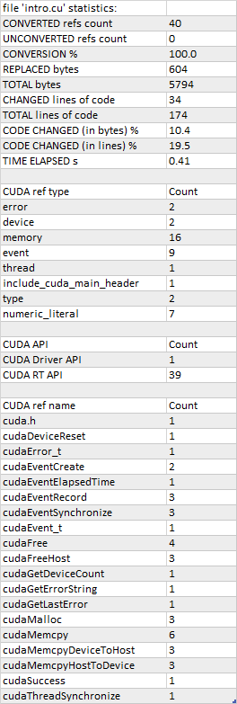

# hipify-clang

`hipify-clang` is a clang-based tool for translating CUDA sources into HIP sources.
It translates CUDA source into an abstract syntax tree, which is traversed by transformation matchers.
After applying all the matchers, the output HIP source is produced.

**Advantages:**

1. It is a translator; thus, any even very complicated constructs will be parsed successfully, or an error will be reported.
2. It supports `clang` options like [`-I`](https://clang.llvm.org/docs/ClangCommandLineReference.html#cmdoption-clang-i-dir), [`-D`](https://clang.llvm.org/docs/ClangCommandLineReference.html#cmdoption-clang-d-macro), [`--cuda-path`](https://clang.llvm.org/docs/ClangCommandLineReference.html#cmdoption-clang-cuda-path), etc.
3. Seamless support of new CUDA versions as it is the clang's responsibility.
4. Ease of support.

**Disadvantages:**

1. The main advantage is also the main disadvantage: the input CUDA code should be correct; incorrect code wouldn't be translated to HIP.
2. CUDA should be installed and provided in case of multiple installations by `--cuda-path` option.
3. All the includes and defines should be provided to transform code successfully.

## <a name="hipify-clang-dependencies"></a>hipify-clang: dependencies

`hipify-clang` requires:

1. [**LLVM+CLANG**](http://releases.llvm.org) of at least version [4.0.0](http://releases.llvm.org/download.html#4.0.0); the latest stable and recommended release: [**17.0.6**](https://github.com/llvm/llvm-project/releases/tag/llvmorg-17.0.6).

2. [**CUDA**](https://developer.nvidia.com/cuda-downloads) of at least version [7.0](https://developer.nvidia.com/cuda-toolkit-70), the latest supported version is [**12.3.2**](https://developer.nvidia.com/cuda-downloads).

<table align="center">
  <thead>
     <tr align="center">
       <th>LLVM release version</th>
       <th>CUDA latest supported version</th>
       <th>Windows</th>
       <th>Linux</th>
    </tr>
  </thead>
  <tbody>
    <tr align="center">
      <td><a href="http://releases.llvm.org/download.html#3.8.0">3.8.0</a>*,
          <a href="http://releases.llvm.org/download.html#3.8.1">3.8.1</a>*,<br>
          <a href="http://releases.llvm.org/download.html#3.9.0">3.9.0</a>*,
          <a href="http://releases.llvm.org/download.html#3.9.1">3.9.1</a>*</td>
      <td><a href="https://developer.nvidia.com/cuda-75-downloads-archive">7.5</a></td>
      <td>+</td>
      <td>+</td>
    </tr>
    <tr align="center">
      <td><a href="http://releases.llvm.org/download.html#4.0.0">4.0.0</a>,
          <a href="http://releases.llvm.org/download.html#4.0.1">4.0.1</a>,<br>
          <a href="http://releases.llvm.org/download.html#5.0.0">5.0.0</a>,
          <a href="http://releases.llvm.org/download.html#5.0.1">5.0.1</a>,
          <a href="http://releases.llvm.org/download.html#5.0.2">5.0.2</a></td>
      <td><a href="https://developer.nvidia.com/cuda-80-ga2-download-archive">8.0</a></td>
      <td>+</td>
      <td>+</td>
    </tr>
    <tr align="center">
      <td><a href="http://releases.llvm.org/download.html#6.0.0">6.0.0</a>,
          <a href="http://releases.llvm.org/download.html#6.0.1">6.0.1</a></td>
      <td><a href="https://developer.nvidia.com/cuda-90-download-archive">9.0</a></td>
      <td>+</td>
      <td>+</td>
    </tr>
    <tr align="center">
      <td><a href="http://releases.llvm.org/download.html#7.0.0">7.0.0</a>,
          <a href="http://releases.llvm.org/download.html#7.0.1">7.0.1</a>,
          <a href="http://releases.llvm.org/download.html#7.1.0">7.1.0</a></td>
      <td><a href="https://developer.nvidia.com/cuda-92-download-archive">9.2</a></td>
      <td>works only with the patch <br> due to the clang's bug <a href="https://bugs.llvm.org/show_bug.cgi?id=38811">38811</a><br>
          <a href="../patches/patch_for_clang_7.0.0_bug_38811.zip">patch for 7.0.0</a>**<br>
          <a href="../patches/patch_for_clang_7.0.1_bug_38811.zip">patch for 7.0.1</a>**<br>
          <a href="../patches/patch_for_clang_7.1.0_bug_38811.zip">patch for 7.1.0</a>**<br></td>
      <td>-<br> not working due to <br> the clang's bug <a href="https://bugs.llvm.org/show_bug.cgi?id=36384">36384</a></td>
    </tr>
    <tr align="center">
      <td><a href="http://releases.llvm.org/download.html#8.0.0">8.0.0</a>,
          <a href="http://releases.llvm.org/download.html#8.0.1">8.0.1</a></td>
      <td><a href="https://developer.nvidia.com/cuda-10.0-download-archive">10.0</a></td>
      <td>works only with the patch <br> due to the clang's bug <a href="https://bugs.llvm.org/show_bug.cgi?id=38811">38811</a><br>
          <a href="../patches/patch_for_clang_8.0.0_bug_38811.zip">patch for 8.0.0</a>**<br>
          <a href="../patches/patch_for_clang_8.0.1_bug_38811.zip">patch for 8.0.1</a>**<br></td>
      <td>+</td>
    </tr>
    <tr align="center">
      <td><a href="http://releases.llvm.org/download.html#9.0.0">9.0.0</a>,
          <a href="http://releases.llvm.org/download.html#9.0.1">9.0.1</a></td>
      <td><a href="https://developer.nvidia.com/cuda-10.1-download-archive-update2">10.1</a></td>
      <td>+</td>
      <td>+</td>
    </tr>
    <tr align="center">
      <td rowspan=2><a href="https://github.com/llvm/llvm-project/releases/tag/llvmorg-10.0.0">10.0.0</a>,
          <a href="https://github.com/llvm/llvm-project/releases/tag/llvmorg-10.0.1">10.0.1</a></td>
      <td><a href="https://developer.nvidia.com/cuda-11.0-download-archive">11.0.0</a></td>
      <td>+</td>
      <td>+</td>
    </tr>
    <tr align="center">
      <td><a href="https://developer.nvidia.com/cuda-11-0-1-download-archive">11.0.1</a>,
          <a href="https://developer.nvidia.com/cuda-11.1.0-download-archive">11.1.0</a>,
          <a href="https://developer.nvidia.com/cuda-11.1.1-download-archive">11.1.1</a></td>
      <td colspan=2>works only with the patch <br> due to the clang's bug <a href="https://bugs.llvm.org/show_bug.cgi?id=47332">47332</a><br>
          <a href="../patches/patch_for_clang_10.0.0_bug_47332.zip">patch for 10.0.0</a>***<br>
          <a href="../patches/patch_for_clang_10.0.1_bug_47332.zip">patch for 10.0.1</a>***<br></td>
    </tr>
    <tr align="center">
      <td rowspan=2><a href="https://github.com/llvm/llvm-project/releases/tag/llvmorg-11.0.0">11.0.0</a></td>
      <td><a href="https://developer.nvidia.com/cuda-11.0-download-archive">11.0.0</a></td>
      <td>+</td>
      <td>+</td>
    </tr>
    <tr align="center">
      <td><a href="https://developer.nvidia.com/cuda-11-0-1-download-archive">11.0.1</a>,
          <a href="https://developer.nvidia.com/cuda-11.1.0-download-archive">11.1.0</a>,
          <a href="https://developer.nvidia.com/cuda-11.1.1-download-archive">11.1.1</a></td>
      <td colspan=2>works only with the patch <br> due to the clang's bug <a href="https://bugs.llvm.org/show_bug.cgi?id=47332">47332</a><br>
          <a href="../patches/patch_for_clang_11.0.0_bug_47332.zip">patch for 11.0.0</a>***</td>
    </tr>
    <tr align="center">
      <td><a href="https://github.com/llvm/llvm-project/releases/tag/llvmorg-11.0.1">11.0.1</a>,
          <a href="https://github.com/llvm/llvm-project/releases/tag/llvmorg-11.1.0">11.1.0</a>
      <td><a href="https://developer.nvidia.com/cuda-11-2-2-download-archive">11.2.2</a></td>
      <td>+</td>
      <td>+</td>
    </tr>
    <tr align="center">
      <td><a href="https://github.com/llvm/llvm-project/releases/tag/llvmorg-12.0.0">12.0.0</a>,
          <a href="https://github.com/llvm/llvm-project/releases/tag/llvmorg-12.0.1">12.0.1</a>,<br>
          <a href="https://github.com/llvm/llvm-project/releases/tag/llvmorg-13.0.0">13.0.0</a>,
          <a href="https://github.com/llvm/llvm-project/releases/tag/llvmorg-13.0.1">13.0.1</a>
      <td><a href="https://developer.nvidia.com/cuda-11-5-1-download-archive">11.5.1</a></td>
      <td>+</td>
      <td>+</td>
    </tr>
    <tr align="center">
      <td><a href="https://github.com/llvm/llvm-project/releases/tag/llvmorg-14.0.0">14.0.0</a>,
          <a href="https://github.com/llvm/llvm-project/releases/tag/llvmorg-14.0.1">14.0.1</a>,<br>
          <a href="https://github.com/llvm/llvm-project/releases/tag/llvmorg-14.0.2">14.0.2</a>,
          <a href="https://github.com/llvm/llvm-project/releases/tag/llvmorg-14.0.3">14.0.3</a>,
          <a href="https://github.com/llvm/llvm-project/releases/tag/llvmorg-14.0.4">14.0.4</a>
      <td><a href="https://developer.nvidia.com/cuda-11-7-1-download-archive">11.7.1</a></td>
      <td>works only with the patch <br> due to the clang's bug <a href="https://github.com/llvm/llvm-project/issues/54609">54609</a><br>
          <a href="../patches/patch_for_clang_14.0.0_bug_54609.zip">patch for 14.0.0</a>**<br>
          <a href="../patches/patch_for_clang_14.0.1_bug_54609.zip">patch for 14.0.1</a>**<br>
          <a href="../patches/patch_for_clang_14.0.2_bug_54609.zip">patch for 14.0.2</a>**<br>
          <a href="../patches/patch_for_clang_14.0.3_bug_54609.zip">patch for 14.0.3</a>**<br>
          <a href="../patches/patch_for_clang_14.0.4_bug_54609.zip">patch for 14.0.4</a>**<br></td>
      <td>+</td>
    <tr align="center">
      <td><a href="https://github.com/llvm/llvm-project/releases/tag/llvmorg-14.0.5">14.0.5</a>,
          <a href="https://github.com/llvm/llvm-project/releases/tag/llvmorg-14.0.6">14.0.6</a>,<br>
          <a href="https://github.com/llvm/llvm-project/releases/tag/llvmorg-15.0.0">15.0.0</a>,
          <a href="https://github.com/llvm/llvm-project/releases/tag/llvmorg-15.0.1">15.0.1</a>,
          <a href="https://github.com/llvm/llvm-project/releases/tag/llvmorg-15.0.2">15.0.2</a>,<br>
          <a href="https://github.com/llvm/llvm-project/releases/tag/llvmorg-15.0.3">15.0.3</a>,
          <a href="https://github.com/llvm/llvm-project/releases/tag/llvmorg-15.0.4">15.0.4</a>,
          <a href="https://github.com/llvm/llvm-project/releases/tag/llvmorg-15.0.5">15.0.5</a>,</br>
          <a href="https://github.com/llvm/llvm-project/releases/tag/llvmorg-15.0.6">15.0.6</a>,
          <a href="https://github.com/llvm/llvm-project/releases/tag/llvmorg-15.0.7">15.0.7</a></td>
      <td><a href="https://developer.nvidia.com/cuda-11-8-0-download-archive">11.8.0</td>
      <td>+</td>
      <td>+</td>
    </tr>
    <tr align="center">
      <td><a href="https://github.com/llvm/llvm-project/releases/tag/llvmorg-16.0.0">16.0.0</a>,
          <a href="https://github.com/llvm/llvm-project/releases/tag/llvmorg-16.0.1">16.0.1</a>,
          <a href="https://github.com/llvm/llvm-project/releases/tag/llvmorg-16.0.2">16.0.2</a>,<br>
          <a href="https://github.com/llvm/llvm-project/releases/tag/llvmorg-16.0.3">16.0.3</a>,
          <a href="https://github.com/llvm/llvm-project/releases/tag/llvmorg-16.0.4">16.0.4</a>,
          <a href="https://github.com/llvm/llvm-project/releases/tag/llvmorg-16.0.5">16.0.5</a>,<br>
          <a href="https://github.com/llvm/llvm-project/releases/tag/llvmorg-16.0.6">16.0.6</a></td>
      <td><a href="https://developer.nvidia.com/cuda-12-2-2-download-archive">12.2.2</a></td>
      <td>+</td>
      <td>+</td>
    </tr>
    <tr align="center">
      <td bgcolor="eefaeb"><a href="https://github.com/llvm/llvm-project/releases/tag/llvmorg-17.0.1">17.0.1</a>,
                           <a href="https://github.com/llvm/llvm-project/releases/tag/llvmorg-17.0.2">17.0.2</a>,
                           <a href="https://github.com/llvm/llvm-project/releases/tag/llvmorg-17.0.3">17.0.3</a>,<br>
                           <a href="https://github.com/llvm/llvm-project/releases/tag/llvmorg-17.0.4">17.0.4</a>,
                           <a href="https://github.com/llvm/llvm-project/releases/tag/llvmorg-17.0.5">17.0.5</a>,
                           <a href="https://github.com/llvm/llvm-project/releases/tag/llvmorg-17.0.6"><b>17.0.6</b></a></td>
      <td bgcolor="eefaeb"><a href="https://developer.nvidia.com/cuda-downloads"><b>12.3.2</b></a></td>
      <td colspan=2 bgcolor="eefaeb"><font color="green"><b>LATEST STABLE CONFIG</b></font></td>
    </tr>
    <tr align="center">
      <td><a href="https://github.com/llvm/llvm-project">19.0.0git</a></td>
      <td><a href="https://developer.nvidia.com/cuda-downloads">12.3.2</a></td>
      <td>+</td>
      <td>+</td>
    </tr>
  </tbody>
</table>

`*`   `LLVM 3.x` is not supported anymore but might still work.

`**`   Download the patch and unpack it into your `LLVM distributive directory`: a few header files will be overwritten; rebuilding of `LLVM` is not needed.

`***`  Download the patch and unpack it into your `LLVM source directory`: the file `Cuda.cpp` will be overwritten; needs further rebuilding of `LLVM`.

In most cases, you can get a suitable version of `LLVM+CLANG` with your package manager.

Failing that or having multiple versions of `LLVM`, you can [download a release archive](http://releases.llvm.org/), build or install it, and set
[CMAKE_PREFIX_PATH](https://cmake.org/cmake/help/v3.5/variable/CMAKE_PREFIX_PATH.html) so `CMake` can find it; for instance: `-DCMAKE_PREFIX_PATH=D:\LLVM\17.0.6\dist`

## <a name="hipify-clang-usage"></a>hipify-clang: usage

To process a file, `hipify-clang` needs access to the same headers that would be required to compile it with `clang`.

For example:

```shell
./hipify-clang square.cu --cuda-path=/usr/local/cuda-12.3 -I /usr/local/cuda-12.3/samples/common/inc
```

`hipify-clang` arguments are given first, followed by a separator `'--'`, and then the arguments you'd pass to `clang` if you were compiling the input file. For example:

```bash
./hipify-clang cpp17.cu --cuda-path=/usr/local/cuda-12.3 -- -std=c++17
```

hipify-clang also supports the hipification of multiple files that might be specified in a single command line with absolute or relative paths, for instance:

```bash
./hipify-clang cpp17.cu ../../square.cu /home/user/cuda/intro.cu --cuda-path=/usr/local/cuda-12.3 -- -std=c++17
```

The [Clang manual for compiling CUDA](https://llvm.org/docs/CompileCudaWithLLVM.html#compiling-cuda-code) may be useful.

## <a name="hipify-clang-using-json-compilation-database"></a>hipify-clang: using JSON Compilation Database

For some hipification automation (starting from `clang` 8.0.0), it is also possible to provide a [Compilation Database in JSON format](https://clang.llvm.org/docs/JSONCompilationDatabase.html) in the `compile_commands.json` file:

```bash
-p <folder containing compile_commands.json> or
-p=<folder containing compile_commands.json>
```

The compilation database should be provided in the `compile_commands.json` file or generated by `clang` based on `CMake`; multiple source files can be specified as well.
Only `clang` options must be provided in the `compile_commands.json` file; `hipify-clang` options can only be provided in the `hipify-clang` command line.

Note: Do not use the options separator `'--'`. A compilation error will occur if the hipify options are provided before the separator.

Here is an example of the `compile_commands.json` usage: https://github.com/ROCm/HIPIFY/blob/amd-staging/tests/unit_tests/compilation_database/compile_commands.json.in

## <a name="hipify-clang-hipification-statistics"></a>hipify-clang: hipification statistics

There are options `--print-stats` and `--print-stats-csv` that help to see an overall picture of what is hipified and what is not and obtain the hipification statistics. For instance:

```
hipify-clang intro.cu -cuda-path="C:/Program Files/NVIDIA GPU Computing Toolkit/CUDA/v12.3.2" --print-stats
```

```
[HIPIFY] info: file 'intro.cu' statistics:
CONVERTED refs count: 40
UNCONVERTED refs count: 0
CONVERSION %: 100.0
REPLACED bytes: 604
[HIPIFY] info: file 'intro.cu' statistics:
  CONVERTED refs count: 40
  UNCONVERTED refs count: 0
  CONVERSION %: 100.0
  REPLACED bytes: 604
  TOTAL bytes: 5794
  CHANGED lines of code: 34
  TOTAL lines of code: 174
  CODE CHANGED (in bytes) %: 10.4
  CODE CHANGED (in lines) %: 19.5
  TIME ELAPSED s: 0.41
[HIPIFY] info: CONVERTED refs by type:
  error: 2
  device: 2
  memory: 16
  event: 9
  thread: 1
  include_cuda_main_header: 1
  type: 2
  numeric_literal: 7
[HIPIFY] info: CONVERTED refs by API:
  CUDA Driver API: 1
  CUDA RT API: 39
[HIPIFY] info: CONVERTED refs by names:
  cuda.h: 1
  cudaDeviceReset: 1
  cudaError_t: 1
  cudaEventCreate: 2
  cudaEventElapsedTime: 1
  cudaEventRecord: 3
  cudaEventSynchronize: 3
  cudaEvent_t: 1
  cudaFree: 4
  cudaFreeHost: 3
  cudaGetDeviceCount: 1
  cudaGetErrorString: 1
  cudaGetLastError: 1
  cudaMalloc: 3
  cudaMemcpy: 6
  cudaMemcpyDeviceToHost: 3
  cudaMemcpyHostToDevice: 3
  cudaSuccess: 1
  cudaThreadSynchronize: 1
```

```
hipify-clang intro.cu -cuda-path="C:/Program Files/NVIDIA GPU Computing Toolkit/CUDA/v12.3.2" --print-stats-csv
```

The generated file with statistics is `intro.cu.csv`:



In the case of multiple source files, the statistics will be provided per file and in total.

For a list of `hipify-clang` options, run `hipify-clang --help`.

## <a name="hipify-clang-building"></a>hipify-clang: building

```bash
cd .. \
mkdir build dist \
cd build

cmake \
 -DCMAKE_INSTALL_PREFIX=../dist \
 -DCMAKE_BUILD_TYPE=Release \
 ../hipify

make -j install
```

On Windows, the following option should be specified for `CMake` in the first place: `-G "Visual Studio 17 2022"`; the generated `hipify-clang.sln` should be built by `Visual Studio 17 2022` instead of `Make.`
Please, see [hipify-clang: Windows](#windows) for the supported tools for building.

Debug build type `-DCMAKE_BUILD_TYPE=Debug` is also supported and tested; `LLVM+CLANG` should be built in `Debug` mode as well.
64-bit build mode (`-Thost=x64` on Windows) is also supported; `LLVM+CLANG` should be built in 64-bit mode as well.

The binary can then be found at `./dist/hipify-clang` or at the folder specified by the `-DCMAKE_INSTALL_PREFIX` option.

## <a name="hipify-clang-testing"></a>hipify-clang: testing

`hipify-clang` has unit tests using `LLVM` [`lit`](https://llvm.org/docs/CommandGuide/lit.html)/[`FileCheck`](https://llvm.org/docs/CommandGuide/FileCheck.html).

`LLVM+CLANG` should be built from sources, pre-built binaries are not exhaustive for testing. Before building ensure that the [software required for building](https://releases.llvm.org/11.0.0/docs/GettingStarted.html#software) is of an appropriate version.

**LLVM <= 9.0.1:**

1. download [`LLVM`](https://github.com/llvm/llvm-project/releases/download/llvmorg-9.0.1/llvm-9.0.1.src.tar.xz)+[`CLANG`](https://github.com/llvm/llvm-project/releases/download/llvmorg-9.0.1/clang-9.0.1.src.tar.xz) sources;
2. build [`LLVM+CLANG`](http://releases.llvm.org/9.0.0/docs/CMake.html):

```bash
     cd .. \
     mkdir build dist \
     cd build
```

 **Linux**:

   ```bash
        cmake \
         -DCMAKE_INSTALL_PREFIX=../dist \
         -DLLVM_SOURCE_DIR=../llvm \
         -DLLVM_TARGETS_TO_BUILD="X86;NVPTX" \
         -DLLVM_INCLUDE_TESTS=OFF \
         -DCMAKE_BUILD_TYPE=Release \
         ../llvm
        make -j install
   ```

 **Windows**:

   ```shell
        cmake \
         -G "Visual Studio 16 2019" \
         -A x64 \
         -Thost=x64 \
         -DCMAKE_INSTALL_PREFIX=../dist \
         -DLLVM_SOURCE_DIR=../llvm \
         -DLLVM_TARGETS_TO_BUILD="NVPTX" \
         -DLLVM_INCLUDE_TESTS=OFF \
         -DCMAKE_BUILD_TYPE=Release \
         ../llvm
   ```

Run `Visual Studio 16 2019`, open the generated `LLVM.sln`, build all, and build the `INSTALL` project.

**LLVM >= 10.0.0:**

1. download [`LLVM project`](https://github.com/llvm/llvm-project/releases/tag/llvmorg-17.0.6) sources;
2. build [`LLVM project`](http://llvm.org/docs/CMake.html):

```bash
      cd .. \
      mkdir build dist \
      cd build
```

 **Linux**:

   ```bash
        cmake \
         -DCMAKE_INSTALL_PREFIX=../dist \
         -DLLVM_TARGETS_TO_BUILD="" \
         -DLLVM_ENABLE_PROJECTS="clang" \
         -DLLVM_INCLUDE_TESTS=OFF \
         -DCMAKE_BUILD_TYPE=Release \
         ../llvm-project/llvm
        make -j install
   ```

 **Windows**:

   ```shell
        cmake \
         -G "Visual Studio 17 2022" \
         -A x64 \
         -Thost=x64 \
         -DCMAKE_INSTALL_PREFIX=../dist \
         -DLLVM_TARGETS_TO_BUILD="" \
         -DLLVM_ENABLE_PROJECTS="clang" \
         -DLLVM_INCLUDE_TESTS=OFF \
         -DCMAKE_BUILD_TYPE=Release \
         ../llvm-project/llvm
   ```

Run `Visual Studio 17 2022`, open the generated `LLVM.sln`, build all, build project `INSTALL`.

3. Ensure [`CUDA`](https://developer.nvidia.com/cuda-toolkit-archive) of minimum version 7.0 is installed.

* Having multiple CUDA installations to choose a particular version the `DCUDA_TOOLKIT_ROOT_DIR` option should be specified:

  * ***Linux***: `-DCUDA_TOOLKIT_ROOT_DIR=/usr/include`

  * ***Windows***: `-DCUDA_TOOLKIT_ROOT_DIR="C:/Program Files/NVIDIA GPU Computing Toolkit/CUDA/v12.3"`

      `-DCUDA_SDK_ROOT_DIR="C:/ProgramData/NVIDIA Corporation/CUDA Samples/v12.3"`

4. Ensure [`cuDNN`](https://developer.nvidia.com/rdp/cudnn-archive) of the version corresponding to CUDA's version is installed.

* Path to [`cuDNN`](https://developer.nvidia.com/rdp/cudnn-download) should be specified by the `CUDA_DNN_ROOT_DIR` option:

  * ***Linux***: `-DCUDA_DNN_ROOT_DIR=/usr/include`

  * ***Windows***: `-DCUDA_DNN_ROOT_DIR=D:/CUDA/cuDNN/8.9.7`

5. Ensure [`CUB`](https://github.com/NVlabs/cub) of the version corresponding to CUDA's version is installed.

* Path to CUB should be specified by the `CUDA_CUB_ROOT_DIR` option:

  * ***Linux***: `-DCUDA_CUB_ROOT_DIR=/srv/git/CUB`

  * ***Windows***: `-DCUDA_CUB_ROOT_DIR=D:/CUDA/CUB/cub-2.1.0`

6. Ensure [`python`](https://www.python.org/downloads) of minimum required version 2.7 is installed.

7. Ensure `lit` and `FileCheck` are installed - these are distributed with `LLVM`.

* Install `lit` into `python`:

  * ***Linux***: `python /usr/llvm/17.0.6/llvm-project/llvm/utils/lit/setup.py install`

  * ***Windows***: `python D:/LLVM/17.0.6/llvm-project/llvm/utils/lit/setup.py install`

    In case of errors, similar to `ModuleNotFoundError: No module named 'setuptools'`, upgrade the `setuptools` package:

    `python -m pip install --upgrade pip setuptools`

* Starting with LLVM 6.0.1 path to `llvm-lit` python script should be specified by the `LLVM_EXTERNAL_LIT` option:

  * ***Linux***: `-DLLVM_EXTERNAL_LIT=/usr/llvm/17.0.6/build/bin/llvm-lit`

  * ***Windows***: `-DLLVM_EXTERNAL_LIT=D:/LLVM/17.0.6/build/Release/bin/llvm-lit.py`

* `FileCheck`:

  * ***Linux***: copy from `/usr/llvm/17.0.6/build/bin/` to `CMAKE_INSTALL_PREFIX/dist/bin`

  * ***Windows***: copy from `D:/LLVM/17.0.6/build/Release/bin` to `CMAKE_INSTALL_PREFIX/dist/bin`

  * Or specify the path to `FileCheck` in `CMAKE_INSTALL_PREFIX` option

8. To run OpenGL tests successfully on:

* ***Linux***: install at least essential GL headers (on Ubuntu by `sudo apt-get install mesa-common-dev`)

* ***Windows***: nothing to do: all the required headers are shipped with Windows SDK

9. Set `HIPIFY_CLANG_TESTS` option turned on: `-DHIPIFY_CLANG_TESTS=ON`.

10. Build and run tests:

## <a name="linux"></a>hipify-clang: Linux testing

On Linux the following configurations are tested:

Ubuntu 14: LLVM 4.0.0 - 7.1.0, CUDA 7.0 - 9.0, cuDNN 5.0.5 - 7.6.5

Ubuntu 16-19: LLVM 8.0.0 - 14.0.6, CUDA 7.0 - 10.2, cuDNN 5.1.10 - 8.0.5

Ubuntu 20-21: LLVM 9.0.0 - 17.0.6, CUDA 7.0 - 12.3.2, cuDNN 5.1.10 - 8.9.7

Ubuntu 22-23: LLVM 13.0.0 - 17.0.6, CUDA 7.0 - 12.3.2, cuDNN 8.0.5 - 8.9.7

Minimum build system requirements for the above configurations:

CMake 3.16.8, GNU C/C++ 9.2, Python 2.7.

Recommended build system requirements:

CMake 3.28.3, GNU C/C++ 13.2, Python 3.12.2.

Here is an example of building `hipify-clang` with testing support on `Ubuntu 23.10.01`:

```bash
cmake
 -DHIPIFY_CLANG_TESTS=ON \
 -DCMAKE_BUILD_TYPE=Release \
 -DCMAKE_INSTALL_PREFIX=../dist \
 -DCMAKE_PREFIX_PATH=/usr/llvm/17.0.6/dist \
 -DCUDA_TOOLKIT_ROOT_DIR=/usr/local/cuda-12.3.2 \
 -DCUDA_DNN_ROOT_DIR=/usr/local/cudnn-8.9.7 \
 -DCUDA_CUB_ROOT_DIR=/usr/local/cub-2.1.0 \
 -DLLVM_EXTERNAL_LIT=/usr/llvm/17.0.6/build/bin/llvm-lit \
 ../hipify
```

*A corresponding successful output:*

```shell
-- The C compiler identification is GNU 13.2.0
-- The CXX compiler identification is GNU 13.2.0
-- Detecting C compiler ABI info
-- Detecting C compiler ABI info - done
-- Check for working C compiler: /usr/bin/cc - skipped
-- Detecting C compile features
-- Detecting C compile features - done
-- Detecting CXX compiler ABI info
-- Detecting CXX compiler ABI info - done
-- Check for working CXX compiler: /usr/bin/c++ - skipped
-- Detecting CXX compile features
-- Detecting CXX compile features - done
-- HIPIFY config:
--    - Build hipify-clang : ON
--    - Test  hipify-clang : ON
--    - Is part of HIP SDK : OFF
-- Found ZLIB: /usr/lib/x86_64-linux-gnu/libz.so (found version "1.2.13")
-- Found LLVM 17.0.6:
--    - CMake module path  : /usr/llvm/17.0.6/dist/lib/cmake/llvm
--    - Clang include path : /usr/llvm/17.0.6/dist/include
--    - LLVM Include path  : /usr/llvm/17.0.6/dist/include
--    - Binary path        : /usr/llvm/17.0.6/dist/bin
-- Linker detection: GNU ld
-- ---- The below configuring for hipify-clang testing only ----
-- Found Python: /usr/bin/python3.12 (found version "3.12.2") found components: Interpreter 
-- Found lit: /usr/local/bin/lit
-- Found FileCheck: /GIT/LLVM/trunk/dist/FileCheck
-- Initial CUDA to configure:
--    - CUDA Toolkit path  : /usr/local/cuda-12.3.2
--    - CUDA Samples path  : OFF
--    - cuDNN path         : /usr/local/cudnn-8.9.7
--    - CUB path           : /usr/local/cub-2.1.0
-- Found CUDAToolkit: /usr/local/cuda-12.3.2/targets/x86_64-linux/include (found version "12.3.107")
-- Performing Test CMAKE_HAVE_LIBC_PTHREAD
-- Performing Test CMAKE_HAVE_LIBC_PTHREAD - Success
-- Found Threads: TRUE
-- Found CUDA config:
--    - CUDA Toolkit path  : /usr/local/cuda-12.3.2
--    - CUDA Samples path  : OFF
--    - cuDNN path         : /usr/local/cudnn-8.9.7
--    - CUB path           : /usr/local/cub-2.1.0
-- Configuring done (0.5s)
-- Generating done (0.0s)
-- Build files have been written to: /usr/hipify/build
```

```shell
make test-hipify
```

*A corresponding successful output:*

```shell
Running HIPify regression tests
===============================================================
CUDA 12.3.107 - will be used for testing
LLVM 17.0.6 - will be used for testing
x86_64 - Platform architecture
Linux 6.5.0-15-generic - Platform OS
64 - hipify-clang binary bitness
64 - python 3.12.2 binary bitness
===============================================================
-- Testing: 102 tests, 12 threads --
Testing Time: 6.70s

Total Discovered Tests: 102
  Passed: 102 (100.00%)
```

## <a name="windows"></a>hipify-clang: Windows testing

*Tested configurations:*

|      **LLVM**   | **CUDA**     |   **cuDNN**    |        **Visual Studio (latest)**         |    **CMake**    |  **Python**   |
|----------------:|-------------:|---------------:|------------------------------------------:|----------------:|--------------:|
| 4.0.0 - 5.0.2   | 7.0 - 8.0    | 5.1.10 - 7.1.4 | 2015.14.0, 2017.15.5.2                    | 3.5.1  - 3.18.0 | 3.6.4 - 3.8.5 |
| 6.0.0 - 6.0.1   | 7.0 - 9.0    | 7.0.5  - 7.6.5 | 2015.14.0, 2017.15.5.5                    | 3.6.0  - 3.18.0 | 3.7.2 - 3.8.5 |
| 7.0.0 - 7.1.0   | 7.0 - 9.2    | 7.6.5          | 2017.15.9.11                              | 3.13.3 - 3.18.0 | 3.7.3 - 3.8.5 |
| 8.0.0 - 8.0.1   | 7.0 - 10.0   | 7.6.5          | 2017.15.9.15                              | 3.14.2 - 3.18.0 | 3.7.4 - 3.8.5 |
| 9.0.0 - 9.0.1   | 7.0 - 10.1   | 7.6.5          | 2017.15.9.20, 2019.16.4.5                 | 3.16.4 - 3.18.0 | 3.8.0 - 3.8.5 |
| 10.0.0 - 11.0.0 | 7.0 - 11.1   | 7.6.5  - 8.0.5 | 2017.15.9.30, 2019.16.8.3                 | 3.19.2          | 3.9.1         |
| 11.0.1 - 11.1.0 | 7.0 - 11.2.2 | 7.6.5  - 8.0.5 | 2017.15.9.31, 2019.16.8.4                 | 3.19.3          | 3.9.2         |
| 12.0.0 - 13.0.1 | 7.0 - 11.5.1 | 7.6.5  - 8.3.2 | 2017.15.9.43, 2019.16.11.9                | 3.22.2          | 3.10.2        |
| 14.0.0 - 14.0.6 | 7.0 - 11.7.1 | 8.0.5  - 8.4.1 | 2017.15.9.57*, 2019.16.11.17, 2022.17.2.6 | 3.24.0          | 3.10.6        |
| 15.0.0 - 15.0.7 | 7.0 - 11.8.0 | 8.0.5  - 8.8.1 | 2019.16.11.25, 2022.17.5.2                | 3.26.0          | 3.11.2        |
| 16.0.0 - 16.0.6 | 7.0 - 12.2.2 | 8.0.5  - 8.9.5 | 2019.16.11.29, 2022.17.7.1                | 3.27.3          | 3.11.4        |
| 17.0.1** 17.0.6 | 7.0 - 12.3.2 | 8.0.5  - 8.9.7 | 2019.16.11.34, 2022.17.9.0                | 3.28.3          | 3.12.2        |
| 19.0.0git       | 7.0 - 12.3.2 | 8.0.5  - 8.9.7 | 2019.16.11.34, 2022.17.9.0                | 3.28.3          | 3.12.2        |

`*` LLVM 14.x.x is the latest major release supporting Visual Studio 2017.
To build LLVM 14.x.x correctly by Visual Studio 2017, `-DLLVM_FORCE_USE_OLD_TOOLCHAIN=ON` should be added to a corresponding `CMake` command line.
LLVM < 14.x.x can be built correctly by Visual Studio 2017 without the `LLVM_FORCE_USE_OLD_TOOLCHAIN` option.

`**` Note that LLVM 17.0.0 was withdrawn due to an issue, please use 17.0.1 or newer instead.

*Building with testing support by `Visual Studio 17 2022` on `Windows 10`:*

```shell
cmake
 -G "Visual Studio 17 2022" \
 -A x64 \
 -Thost=x64 \
 -DHIPIFY_CLANG_TESTS=ON \
 -DCMAKE_BUILD_TYPE=Release \
 -DCMAKE_INSTALL_PREFIX=../dist \
 -DCMAKE_PREFIX_PATH=D:/LLVM/17.0.6/dist \
 -DCUDA_TOOLKIT_ROOT_DIR="C:/Program Files/NVIDIA GPU Computing Toolkit/CUDA/v12.3" \
 -DCUDA_SDK_ROOT_DIR="C:/ProgramData/NVIDIA Corporation/CUDA Samples/v12.3" \
 -DCUDA_DNN_ROOT_DIR=D:/CUDA/cuDNN/8.9.7 \
 -DCUDA_CUB_ROOT_DIR=D:/CUDA/CUB/cub-2.1.0 \
 -DLLVM_EXTERNAL_LIT=D:/LLVM/17.0.6/build/Release/bin/llvm-lit.py \
 ../hipify
```

*A corresponding successful output:*

```shell
-- Selecting Windows SDK version 10.0.22621.0 to target Windows 10.0.19045.
-- The C compiler identification is MSVC 19.37.32824.0
-- The CXX compiler identification is MSVC 19.37.32824.0
-- Detecting C compiler ABI info
-- Detecting C compiler ABI info - done
-- Check for working C compiler: C:/Program Files/Microsoft Visual Studio/2022/Community/VC/Tools/MSVC/14.37.32822/bin/Hostx64/x64/cl.exe - skipped
-- Detecting C compile features
-- Detecting C compile features - done
-- Detecting CXX compiler ABI info
-- Detecting CXX compiler ABI info - done
-- Check for working CXX compiler: C:/Program Files/Microsoft Visual Studio/2022/Community/VC/Tools/MSVC/14.37.32822/bin/Hostx64/x64/cl.exe - skipped
-- Detecting CXX compile features
-- Detecting CXX compile features - done
-- HIPIFY config:
--    - Build hipify-clang : ON
--    - Test  hipify-clang : ON
--    - Is part of HIP SDK : OFF
-- Found LLVM 17.0.6:
--    - CMake module path  : D:/LLVM/17.0.6/dist/lib/cmake/llvm
--    - Clang include path : D:/LLVM/17.0.6/dist/include
--    - LLVM Include path  : D:/LLVM/17.0.6/dist/include
--    - Binary path        : D:/LLVM/17.0.6/dist/bin
-- ---- The below configuring for hipify-clang testing only ----
-- Found Python: C:/Users/TT/AppData/Local/Programs/Python/Python312/python.exe (found version "3.12.2") found components: Interpreter
-- Found lit: C:/Users/TT/AppData/Local/Programs/Python/Python312/Scripts/lit.exe
-- Found FileCheck: D:/LLVM/17.0.6/dist/bin/FileCheck.exe
-- Initial CUDA to configure:
--    - CUDA Toolkit path  : C:/Program Files/NVIDIA GPU Computing Toolkit/CUDA/v12.3
--    - CUDA Samples path  : C:/ProgramData/NVIDIA Corporation/CUDA Samples/v12.3
--    - cuDNN path         : D:/CUDA/cuDNN/8.9.7
--    - CUB path           : D:/CUDA/CUB/cub-2.1.0
-- Found CUDAToolkit: C:/Program Files/NVIDIA GPU Computing Toolkit/CUDA/v12.3/include (found version "12.3.52")
-- Found CUDA config:
--    - CUDA Toolkit path  : C:/Program Files/NVIDIA GPU Computing Toolkit/CUDA/v12.3
--    - CUDA Samples path  : C:/ProgramData/NVIDIA Corporation/CUDA Samples/v12.3
--    - cuDNN path         : D:/CUDA/cuDNN/8.9.7
--    - CUB path           : D:/CUDA/CUB/cub-2.1.0
-- Configuring done (1.4s)
-- Generating done (0.1s)
-- Build files have been written to: D:/HIPIFY/build
```

Run `Visual Studio 17 2022`, open the generated `hipify-clang.sln`, build the project `test-hipify`.
