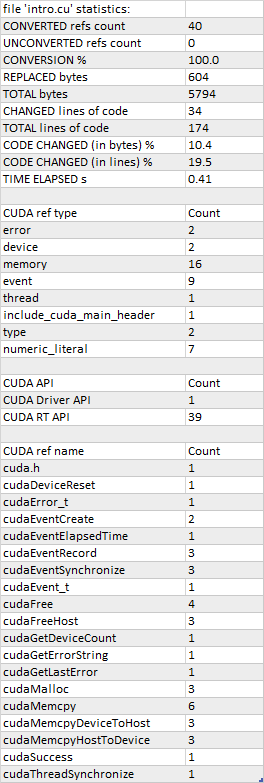

**************************************************************************
hipify-clang
**************************************************************************

``hipify-clang`` is a Clang-based tool for translating CUDA sources into HIP sources.

It translates CUDA source into an abstract syntax tree (AST), which is traversed by transformation
matchers. After applying all the matchers, the output HIP source is produced.

**Advantages:**

* ``hipify-clang`` is a translator; any complex constructs will be parsed successfully, or an error will be
  reported.
* It supports Clang options like
  `-I <https://clang.llvm.org/docs/ClangCommandLineReference.html#include-path-management>`_,
  `-D <https://clang.llvm.org/docs/ClangCommandLineReference.html#preprocessor-options>`_, and
  `--cuda-path <https://clang.llvm.org/docs/ClangCommandLineReference.html#cmdoption-clang-cuda-path>`_.
* There's seamless support of new CUDA versions, as the Clang front-end is statically linked into
  ``hipify-clang`` and does all the syntactical parsing of a CUDA source to HIPIFY.
* There's ease of support as a compiler extension.

**Disadvantages:**

* You must ensure the input CUDA code is correct; incorrect code will not be translated to HIP.
* CUDA should be installed and provided in case of multiple installations by ``--cuda-path`` option.
* All the includes and defines should be provided to transform code successfully.

Dependencies
=====================================================

``hipify-clang`` requires:

* `LLVM+Clang <http://releases.llvm.org>`_ of at least version
  `4.0.0 <http://releases.llvm.org/download.html#4.0.0>`_; the latest stable and recommended release:
  `18.1.4 <https://github.com/llvm/llvm-project/releases/tag/llvmorg-18.1.4>`_.

* `CUDA <https://developer.nvidia.com/cuda-downloads>`_ of at least version
  `7.0 <https://developer.nvidia.com/cuda-toolkit-70>`_, the latest supported version is
  `12.3.2 <https://developer.nvidia.com/cuda-downloads>`_.

.. list-table::
  :header-rows: 1

  * - LLVM release version
    - Latest supported CUDA version
    - Windows
    - Linux
  * - `3.8.0 <http://releases.llvm.org/download.html#3.8.0>`_:sup:`1`,
      `3.8.1 <http://releases.llvm.org/download.html#3.8.1>`_:sup:`1`,
      `3.9.0 <http://releases.llvm.org/download.html#3.9.0>`_:sup:`1`,
      `3.9.1 <http://releases.llvm.org/download.html#3.9.1>`_:sup:`1`
    - `7.5 <https://developer.nvidia.com/cuda-75-downloads-archive>`_
    - \+
    - \+
  * - `4.0.0 <http://releases.llvm.org/download.html#4.0.0>`_,
      `4.0.1 <http://releases.llvm.org/download.html#4.0.1>`_,
      `5.0.0 <http://releases.llvm.org/download.html#5.0.0>`_,
      `5.0.1 <http://releases.llvm.org/download.html#5.0.1>`_,
      `5.0.2 <http://releases.llvm.org/download.html#5.0.2>`_
    - `8.0 <https://developer.nvidia.com/cuda-80-ga2-download-archive>`_
    - \+
    - \+
  * - `6.0.0 <http://releases.llvm.org/download.html#6.0.0>`_,
      `6.0.1 <http://releases.llvm.org/download.html#6.0.1>`_
    - `9.0 <https://developer.nvidia.com/cuda-90-download-archive>`_
    - \+
    - \+
  * - `7.0.0 <http://releases.llvm.org/download.html#7.0.0>`_,
      `7.0.1 <http://releases.llvm.org/download.html#7.0.1>`_,
      `7.1.0 <http://releases.llvm.org/download.html#7.1.0>`_
    - `9.2 <https://developer.nvidia.com/cuda-92-download-archive>`_
    - | works only with patch (Clang bug `38811 <https://bugs.llvm.org/show_bug.cgi?id=38811>`_)
      | :download:`patch for 7.0.0 <./data/patches/patch_for_clang_7.0.0_bug_38811.zip>`:sup:`2`
      | :download:`patch for 7.0.1 <./data/patches/patch_for_clang_7.0.1_bug_38811.zip>`:sup:`2`
      | :download:`patch for 7.1.0 <./data/patches/patch_for_clang_7.1.0_bug_38811.zip>`:sup:`2`
    - not working (Clang bug `36384 <https://bugs.llvm.org/show_bug.cgi?id=36384">`_)
  * - `8.0.0 <http://releases.llvm.org/download.html#8.0.0>`_,
      `8.0.1 <http://releases.llvm.org/download.html#8.0.1>`_
    - `10.0 <https://developer.nvidia.com/cuda-10.0-download-archive>`_
    - | works only with patch (Clang bug `38811 <https://bugs.llvm.org/show_bug.cgi?id=38811>`_)
      | :download:`patch for 8.0.0 <./data/patches/patch_for_clang_8.0.0_bug_38811.zip>`:sup:`2`
      | :download:`patch for 8.0.1 <./data/patches/patch_for_clang_8.0.1_bug_38811.zip>`:sup:`2`
    - \+
  * - `9.0.0 <http://releases.llvm.org/download.html#9.0.0>`_,
      `9.0.1 <http://releases.llvm.org/download.html#9.0.1>`_
    - `10.1 <https://developer.nvidia.com/cuda-10.1-download-archive-update2>`_
    - \+
    - \+
  * - `10.0.0 <https://github.com/llvm/llvm-project/releases/tag/llvmorg-10.0.0>`_,
      `10.0.1 <https://github.com/llvm/llvm-project/releases/tag/llvmorg-10.0.1>`_
    - `11.0.0 <https://developer.nvidia.com/cuda-11.0-download-archive>`_
    - \+
    - \+
  * - `10.0.0 <https://github.com/llvm/llvm-project/releases/tag/llvmorg-10.0.0>`_,
      `10.0.1 <https://github.com/llvm/llvm-project/releases/tag/llvmorg-10.0.1>`_
    - `11.0.1 <https://developer.nvidia.com/cuda-11-0-1-download-archive>`_,
      `11.1.0 <https://developer.nvidia.com/cuda-11.1.0-download-archive>`_,
      `11.1.1 <https://developer.nvidia.com/cuda-11.1.1-download-archive>`_
    - | works only with patch (Clang bug `47332 <https://bugs.llvm.org/show_bug.cgi?id=47332>`_)
      | :download:`patch for 10.0.0 <./data/patches/patch_for_clang_10.0.0_bug_47332.zip>`:sup:`3`
      | :download:`patch for 10.0.1 <./data/patches/patch_for_clang_10.0.1_bug_47332.zip>`:sup:`3`
    - | works only with patch (Clang bug `47332 <https://bugs.llvm.org/show_bug.cgi?id=47332>`_)
      | :download:`patch for 10.0.0 <./data/patches/patch_for_clang_10.0.0_bug_47332.zip>`:sup:`3`
      | :download:`patch for 10.0.1 <./data/patches/patch_for_clang_10.0.1_bug_47332.zip>`:sup:`3`
  * - `11.0.0 <https://github.com/llvm/llvm-project/releases/tag/llvmorg-11.0.0>`_
    - `11.0.0 <https://developer.nvidia.com/cuda-11.0-download-archive>`_
    - \+
    - \+
  * - `11.0.0 <https://github.com/llvm/llvm-project/releases/tag/llvmorg-11.0.0>`_
    - `11.0.1 <https://developer.nvidia.com/cuda-11-0-1-download-archive>`_,
      `11.1.0 <https://developer.nvidia.com/cuda-11.1.0-download-archive>`_,
      `11.1.1 <https://developer.nvidia.com/cuda-11.1.1-download-archive>`_
    - | works only with patch (Clang bug `47332 <https://bugs.llvm.org/show_bug.cgi?id=47332>`_)
      | :download:`patch for 11.0.0 <./data/patches/patch_for_clang_11.0.0_bug_47332.zip>`:sup:`3`
    - | works only with patch (Clang bug `47332 <https://bugs.llvm.org/show_bug.cgi?id=47332>`_)
      | :download:`patch for 11.0.0 <./data/patches/patch_for_clang_11.0.0_bug_47332.zip>`:sup:`3`
  * - `11.0.1 <https://github.com/llvm/llvm-project/releases/tag/llvmorg-11.0.1>`_,
      `11.1.0 <https://github.com/llvm/llvm-project/releases/tag/llvmorg-11.1.0>`_
    - `11.2.2 <https://developer.nvidia.com/cuda-11-2-2-download-archive>`_
    - \+
    - \+
  * - `12.0.0 <https://github.com/llvm/llvm-project/releases/tag/llvmorg-12.0.0>`_,
      `12.0.1 <https://github.com/llvm/llvm-project/releases/tag/llvmorg-12.0.1>`_,
      `13.0.0 <https://github.com/llvm/llvm-project/releases/tag/llvmorg-13.0.0>`_,
      `13.0.1 <https://github.com/llvm/llvm-project/releases/tag/llvmorg-13.0.1>`_
    - `11.5.1 <https://developer.nvidia.com/cuda-11-5-1-download-archive>`_
    - \+
    - \+
  * - `14.0.0 <https://github.com/llvm/llvm-project/releases/tag/llvmorg-14.0.0>`_,
      `14.0.1 <https://github.com/llvm/llvm-project/releases/tag/llvmorg-14.0.1>`_,
      `14.0.2 <https://github.com/llvm/llvm-project/releases/tag/llvmorg-14.0.2>`_,
      `14.0.3 <https://github.com/llvm/llvm-project/releases/tag/llvmorg-14.0.3>`_,
      `14.0.4 <https://github.com/llvm/llvm-project/releases/tag/llvmorg-14.0.4>`_
    - `11.7.1 <https://developer.nvidia.com/cuda-11-7-1-download-archive>`_
    - | works only with patch (Clang bug `54609 <https://github.com/llvm/llvm-project/issues/54609>`_)
      | :download:`patch for 14.0.0 <./data/patches/patch_for_clang_14.0.0_bug_54609.zip>`:sup:`2`
      | :download:`patch for 14.0.1 <./data/patches/patch_for_clang_14.0.1_bug_54609.zip>`:sup:`2`
      | :download:`patch for 14.0.2 <./data/patches/patch_for_clang_14.0.2_bug_54609.zip>`:sup:`2`
      | :download:`patch for 14.0.3 <./data/patches/patch_for_clang_14.0.3_bug_54609.zip>`:sup:`2`
      | :download:`patch for 14.0.4 <./data/patches/patch_for_clang_14.0.4_bug_54609.zip>`:sup:`2`
    - \+
  * - `14.0.5 <https://github.com/llvm/llvm-project/releases/tag/llvmorg-14.0.5>`_,
      `14.0.6 <https://github.com/llvm/llvm-project/releases/tag/llvmorg-14.0.6>`_,
      `15.0.0 <https://github.com/llvm/llvm-project/releases/tag/llvmorg-15.0.0>`_,
      `15.0.1 <https://github.com/llvm/llvm-project/releases/tag/llvmorg-15.0.1>`_,
      `15.0.2 <https://github.com/llvm/llvm-project/releases/tag/llvmorg-15.0.2>`_,
      `15.0.3 <https://github.com/llvm/llvm-project/releases/tag/llvmorg-15.0.3>`_,
      `15.0.4 <https://github.com/llvm/llvm-project/releases/tag/llvmorg-15.0.4>`_,
      `15.0.5 <https://github.com/llvm/llvm-project/releases/tag/llvmorg-15.0.5>`_,
      `15.0.6 <https://github.com/llvm/llvm-project/releases/tag/llvmorg-15.0.6>`_,
      `15.0.7 <https://github.com/llvm/llvm-project/releases/tag/llvmorg-15.0.7>`_
    - `11.8.0 <https://developer.nvidia.com/cuda-11-8-0-download-archive>`_
    - \+
    - \+
  * - `16.0.0 <https://github.com/llvm/llvm-project/releases/tag/llvmorg-16.0.0>`_,
      `16.0.1 <https://github.com/llvm/llvm-project/releases/tag/llvmorg-16.0.1>`_,
      `16.0.2 <https://github.com/llvm/llvm-project/releases/tag/llvmorg-16.0.2>`_,
      `16.0.3 <https://github.com/llvm/llvm-project/releases/tag/llvmorg-16.0.3>`_,
      `16.0.4 <https://github.com/llvm/llvm-project/releases/tag/llvmorg-16.0.4>`_,
      `16.0.5 <https://github.com/llvm/llvm-project/releases/tag/llvmorg-16.0.5>`_,
      `16.0.6 <https://github.com/llvm/llvm-project/releases/tag/llvmorg-16.0.6>`_
    - `12.2.2 <https://developer.nvidia.com/cuda-12-2-2-download-archive>`_
    - \+
    - \+
  * - `17.0.1 <https://github.com/llvm/llvm-project/releases/tag/llvmorg-17.0.1>`_,
      `17.0.2 <https://github.com/llvm/llvm-project/releases/tag/llvmorg-17.0.2>`_,
      `17.0.3 <https://github.com/llvm/llvm-project/releases/tag/llvmorg-17.0.3>`_,
      `17.0.4 <https://github.com/llvm/llvm-project/releases/tag/llvmorg-17.0.4>`_,
      `17.0.5 <https://github.com/llvm/llvm-project/releases/tag/llvmorg-17.0.5>`_,
      `17.0.6 <https://github.com/llvm/llvm-project/releases/tag/llvmorg-17.0.6>`_,
      `18.1.0 <https://github.com/llvm/llvm-project/releases/tag/llvmorg-18.1.0>`_,
      `18.1.1 <https://github.com/llvm/llvm-project/releases/tag/llvmorg-18.1.1>`_,
      `18.1.2 <https://github.com/llvm/llvm-project/releases/tag/llvmorg-18.1.2>`_,
      `18.1.3 <https://github.com/llvm/llvm-project/releases/tag/llvmorg-18.1.3>`_,
      `18.1.4 <https://github.com/llvm/llvm-project/releases/tag/llvmorg-18.1.4>`_:sup:`4`
    - `12.3.2 <https://developer.nvidia.com/cuda-downloads>`_:sup:`4`
    - **LATEST STABLE CONFIG**
    - **LATEST STABLE CONFIG**
  * - `19.0.0 git <https://github.com/llvm/llvm-project>`_
    - `12.4.1 <https://developer.nvidia.com/cuda-downloads>`_
    - \+
    - \+

:sup:`1` ``LLVM 3.x`` is no longer supported (but might still work).

:sup:`2` Download the patch and unpack it into your ``LLVM distributive directory``; a few header files
will be overwritten. You don't need to rebuild ``LLVM``.

:sup:`3` Download the patch and unpack it into your ``LLVM source directory``; the ``Cuda.cpp`` file will
be overwritten. You'll need to rebuild ``LLVM``.

:sup:`4` Represents the latest supported and recommended configuration.

In most cases, you can get a suitable version of ``LLVM+Clang`` with your package manager.

Failing that or having multiple versions of `LLVM`, you can
`download a release archive <http://releases.llvm.org/>`_, build or install it, and set
`CMAKE_PREFIX_PATH <https://cmake.org/cmake/help/latest/variable/CMAKE_PREFIX_PATH.html>`_ so
``CMake`` can find it. For instance: ``-DCMAKE_PREFIX_PATH=D:\LLVM\18.1.4\dist``

Usage
============================================================

To process a file, ``hipify-clang`` needs access to the same headers that would be required to compile it
with ``Clang``. For example:

.. code:: shell

  ./hipify-clang square.cu --cuda-path=/usr/local/cuda-12.3 -I /usr/local/cuda-12.3/samples/common/inc

``hipify-clang`` arguments are given first, followed by a separator (``--``), and then the arguments you'd
pass to Clang if you were compiling the input file. For example:

.. code:: shell

  ./hipify-clang cpp17.cu --cuda-path=/usr/local/cuda-12.3 -- -std=c++17

``hipify-clang`` also supports the hipification of multiple files that might be specified in a single
command line with absolute or relative paths. For example:

.. code:: shell

  ./hipify-clang cpp17.cu ../../square.cu /home/user/cuda/intro.cu --cuda-path=/usr/local/cuda-12.3 -- -std=c++17

To use a specific version of LLVM during hipification, the ``hipify-clang`` option
``--clang-resource-directory=`` must be specified to point to the Clang resource directory, which is the
parent directory for the ``include`` folder that contains ``__clang_cuda_runtime_wrapper.h`` and other
header files used during the hipification process. For example:

.. code:: shell

  ./hipify-clang square.cu --cuda-path=/usr/local/cuda-12.3 --clang-resource-directory=/usr/llvm/18.1.4/dist/lib/clang/18

The `Clang manual for compiling CUDA <https://llvm.org/docs/CompileCudaWithLLVM.html#compiling-cuda-code>`_
may be useful.

Using JSON compilation database
=====================================================

For some hipification automation (starting from Clang 8.0.0), it is also possible to provide a
`Compilation Database in JSON format <https://clang.llvm.org/docs/JSONCompilationDatabase.html>`_
in the ``compile_commands.json`` file:

.. code:: bash

  -p <folder containing compile_commands.json> or
  -p=<folder containing compile_commands.json>

The compilation database should be provided in the ``compile_commands.json`` file or generated by
Clang based on CMake; multiple source files can be specified as well.

Only Clang options must be provided in the ``compile_commands.json`` file; ``hipify-clang`` options can
only be provided in the ``hipify-clang`` command line.

.. note::

  Do not use the options separator ``--``. A compilation error will occur if the ``hipify-clang`` options are
  provided before the separator.

Here's an
`example <https://github.com/ROCm/HIPIFY/blob/amd-staging/tests/unit_tests/compilation_database/compile_commands.json.in>`_
of the ``compile_commands.json`` usage:

.. code:: json

  [
    {
      "directory": "<test dir>",
      "command": "hipify-clang \"<CUDA dir>\" -I./include -v",
      "file": "cd_intro.cu"
    }
  ]

Hipification statistics
=======================================================

The options ``--print-stats`` and ``--print-stats-csv`` help show an overall picture of what is hipified and
what is not, and obtain the hipification statistics. For example:

.. code:: cpp

  hipify-clang intro.cu -cuda-path="C:/Program Files/NVIDIA GPU Computing Toolkit/CUDA/v12.3.2" --print-stats

.. code:: cpp

  [HIPIFY] info: file 'intro.cu' statistics:
  CONVERTED refs count: 40
  UNCONVERTED refs count: 0
  CONVERSION %: 100.0
  REPLACED bytes: 604
  [HIPIFY] info: file 'intro.cu' statistics:
    CONVERTED refs count: 40
    UNCONVERTED refs count: 0
    CONVERSION %: 100.0
    REPLACED bytes: 604
    TOTAL bytes: 5794
    CHANGED lines of code: 34
    TOTAL lines of code: 174
    CODE CHANGED (in bytes) %: 10.4
    CODE CHANGED (in lines) %: 19.5
    TIME ELAPSED s: 0.41
  [HIPIFY] info: CONVERTED refs by type:
    error: 2
    device: 2
    memory: 16
    event: 9
    thread: 1
    include_cuda_main_header: 1
    type: 2
    numeric_literal: 7
  [HIPIFY] info: CONVERTED refs by API:
    CUDA Driver API: 1
    CUDA RT API: 39
  [HIPIFY] info: CONVERTED refs by names:
    cuda.h: 1
    cudaDeviceReset: 1
    cudaError_t: 1
    cudaEventCreate: 2
    cudaEventElapsedTime: 1
    cudaEventRecord: 3
    cudaEventSynchronize: 3
    cudaEvent_t: 1
    cudaFree: 4
    cudaFreeHost: 3
    cudaGetDeviceCount: 1
    cudaGetErrorString: 1
    cudaGetLastError: 1
    cudaMalloc: 3
    cudaMemcpy: 6
    cudaMemcpyDeviceToHost: 3
    cudaMemcpyHostToDevice: 3
    cudaSuccess: 1
    cudaThreadSynchronize: 1

.. code:: cpp

  hipify-clang intro.cu -cuda-path="C:/Program Files/NVIDIA GPU Computing Toolkit/CUDA/v12.3.2" --print-stats-csv

The generated file with statistics is ``intro.cu.csv``:

In the case of multiple source files, the statistics will be provided per file and in total.

For a list of ``hipify-clang`` options, run ``hipify-clang --help``.

Building hipify-clang
=====================================

Once you've cloned the HIPIFY repository (``git clone https://github.com/ROCm/HIPIFY.git``), you must
run the following commands from the HIPIFY root folder.

.. code:: bash

  cd .. \
  mkdir build dist \
  cd build

  cmake \
  -DCMAKE_INSTALL_PREFIX=../dist \
  -DCMAKE_BUILD_TYPE=Release \
  ../hipify

  make -j install

Having not found or multiple LLVM instances, the root folder with the LLVM distributive must be
specified in the CMake command line to build ``hipify-clang``. For example:

.. code:: bash

  -DCMAKE_PREFIX_PATH=/usr/llvm/18.1.4/dist

On Windows, the following option should be specified for CMake in the first place:
``-G "Visual Studio 17 2022"``. The generated ``hipify-clang.sln`` should be built by
``Visual Studio 17 2022`` instead of ``Make``. See :ref:`Windows testing` for the
supported tools for building.

Debug build type ``-DCMAKE_BUILD_TYPE=Debug`` is supported and tested. ``LLVM+Clang``
should be built in ``debug`` mode.

64-bit build mode (``-Thost=x64`` on Windows) is also supported. ``LLVM+Clang`` should be built in
64-bit mode.

You can find the binary at ``./dist/hipify-clang`` or at the folder specified by the
``-DCMAKE_INSTALL_PREFIX`` option.

Testing hipify-clang
================================================

``hipify-clang`` has unit tests using LLVM
`lit <https://llvm.org/docs/CommandGuide/lit.html>`_/`FileCheck <https://llvm.org/docs/CommandGuide/FileCheck.html>`_.

``LLVM+Clang`` should be built from sources, as pre-built binaries are not exhaustive for testing. Before
building, ensure that the
`software required for building <https://releases.llvm.org/11.0.0/docs/GettingStarted.html#software>`_
is of an appropriate version.

LLVM <= 9.0.1
---------------------------------------------------------------------

1. Download `LLVM <https://github.com/llvm/llvm-project/releases/download/llvmorg-9.0.1/llvm-9.0.1.src.tar.xz>`_ \+ `Clang <https://github.com/llvm/llvm-project/releases/download/llvmorg-9.0.1/clang-9.0.1.src.tar.xz>`_ sources

2. Build `LLVM+Clang <http://releases.llvm.org/9.0.0/docs/CMake.html>`_:

   .. code:: bash

      cd .. \
      mkdir build dist \
      cd build

   **Linux**:

   .. code:: bash

      cmake \
        -DCMAKE_INSTALL_PREFIX=../dist \
        -DLLVM_SOURCE_DIR=../llvm \
        -DLLVM_TARGETS_TO_BUILD="X86;NVPTX" \
        -DLLVM_INCLUDE_TESTS=OFF \
        -DCMAKE_BUILD_TYPE=Release \
        ../llvm
      make -j install

   **Windows**:

   .. code:: shell

      cmake \
        -G "Visual Studio 16 2019" \
        -A x64 \
        -Thost=x64 \
        -DCMAKE_INSTALL_PREFIX=../dist \
        -DLLVM_SOURCE_DIR=../llvm \
        -DLLVM_TARGETS_TO_BUILD="NVPTX" \
        -DLLVM_INCLUDE_TESTS=OFF \
        -DCMAKE_BUILD_TYPE=Release \
        ../llvm

   Run ``Visual Studio 16 2019``, open the generated ``LLVM.sln``, build all, and build the ``INSTALL``
   project.

LLVM >= 10.0.0
---------------------------------------------------------------------

1. Download `LLVM project <https://github.com/llvm/llvm-project/releases/tag/llvmorg-18.1.4>`_ sources.

2. Build `LLVM project <http://llvm.org/docs/CMake.html>`_:

   .. code:: bash

      cd .. \
      mkdir build dist \
      cd build

   **Linux**:

   .. code:: bash

      cmake \
        -DCMAKE_INSTALL_PREFIX=../dist \
        -DLLVM_TARGETS_TO_BUILD="" \
        -DLLVM_ENABLE_PROJECTS="clang" \
        -DLLVM_INCLUDE_TESTS=OFF \
        -DCMAKE_BUILD_TYPE=Release \
        ../llvm-project/llvm
      make -j install

   **Windows**:

   .. code:: shell

      cmake \
        -G "Visual Studio 17 2022" \
        -A x64 \
        -Thost=x64 \
        -DCMAKE_INSTALL_PREFIX=../dist \
        -DLLVM_TARGETS_TO_BUILD="" \
        -DLLVM_ENABLE_PROJECTS="clang" \
        -DLLVM_INCLUDE_TESTS=OFF \
        -DCMAKE_BUILD_TYPE=Release \
        ../llvm-project/llvm

   Run ``Visual Studio 17 2022``, open the generated ``LLVM.sln``, build all, build project ``INSTALL``.

3. Ensure you've installed `CUDA <https://developer.nvidia.com/cuda-toolkit-archive>`_ version 7.0 or
   greater.

   * Having multiple CUDA installations to choose a particular version, you must specify the
     ``DCUDA_TOOLKIT_ROOT_DIR`` option:

     **Linux**:

     .. code:: bash

        -DCUDA_TOOLKIT_ROOT_DIR=/usr/include

     **Windows**:

     .. code:: shell

        -DCUDA_TOOLKIT_ROOT_DIR="C:/Program Files/NVIDIA GPU Computing Toolkit/CUDA/v12.3"

        -DCUDA_SDK_ROOT_DIR="C:/ProgramData/NVIDIA Corporation/CUDA Samples/v12.3"

4. Ensure `cuDNN <https://developer.nvidia.com/rdp/cudnn-archive>`_ of the version corresponding
   to CUDA version is installed.

   * Specify the path to `cuDNN <https://developer.nvidia.com/cudnn-downloads>`_ using the
     ``CUDA_DNN_ROOT_DIR`` option:

     **Linux**:

     .. code:: bash

        -DCUDA_DNN_ROOT_DIR=/usr/include

     **Windows**:

     .. code:: shell

        -DCUDA_DNN_ROOT_DIR=D:/CUDA/cuDNN/9.1.0

5. Ensure `CUB <https://github.com/nvidia/cub>`_ of the version corresponding to CUDA version is
   installed.

   * Path to CUB should be specified by the ``CUDA_CUB_ROOT_DIR`` option:

     **Linux**:

     .. code:: bash

        -DCUDA_CUB_ROOT_DIR=/srv/git/CUB

     **Windows**:

     .. code:: shell

        -DCUDA_CUB_ROOT_DIR=D:/CUDA/CUB/cub-2.1.0

6. Ensure `Python <https://www.python.org/downloads>`_ version 2.7 or greater is installed.

7. Ensure ``lit`` and ``FileCheck`` are installed; these are distributed with LLVM.

   * Install ``lit`` into ``Python``:

     **Linux**:

     .. code:: bash

        python /usr/llvm/18.1.4/llvm-project/llvm/utils/lit/setup.py install

     **Windows**:

     .. code:: shell

        python D:/LLVM/18.1.4/llvm-project/llvm/utils/lit/setup.py install

     In case of errors similar to ``ModuleNotFoundError: No module named 'setuptools'``, upgrade the
     ``setuptools`` package:

     .. code:: shell

        ``python -m pip install --upgrade pip setuptools``

   * Starting with LLVM 6.0.1, specify the path to the ``llvm-lit`` Python script using the
     ``LLVM_EXTERNAL_LIT`` option:

     **Linux**:

     .. code:: bash

        -DLLVM_EXTERNAL_LIT=/usr/llvm/18.1.4/build/bin/llvm-lit

     **Windows**:

     .. code:: shell

        -DLLVM_EXTERNAL_LIT=D:/LLVM/18.1.4/build/Release/bin/llvm-lit.py

   * ``FileCheck``:

     **Linux**:

     Copy from ``/usr/llvm/18.1.4/build/bin/`` to ``CMAKE_INSTALL_PREFIX/dist/bin``.

     **Windows**:

     Copy from ``D:/LLVM/18.1.4/build/Release/bin`` to ``CMAKE_INSTALL_PREFIX/dist/bin``.

     Alternatively, specify the path to ``FileCheck`` in the ``CMAKE_INSTALL_PREFIX`` option.

8. To run OpenGL tests successfully on:

   **Linux**:

   Install GL headers (on Ubuntu, use: ``sudo apt-get install mesa-common-dev``)

   **Windows**:

   There's nothing to do; all the required headers are shipped with the Windows SDK.

9. Set the ``HIPIFY_CLANG_TESTS`` option to ``ON``: ``-DHIPIFY_CLANG_TESTS=ON``

10.  Build and run tests.

Linux testing
======================================================

On Linux, the following configurations are tested:

* Ubuntu 14: LLVM 4.0.0 - 7.1.0, CUDA 7.0 - 9.0, cuDNN 5.0.5 - 7.6.5
* Ubuntu 16-19: LLVM 8.0.0 - 14.0.6, CUDA 7.0 - 10.2, cuDNN 5.1.10 - 8.0.5
* Ubuntu 20-21: LLVM 9.0.0 - 18.1.4, CUDA 7.0 - 12.3.2, cuDNN 5.1.10 - 9.1.0
* Ubuntu 22-23: LLVM 13.0.0 - 18.1.4, CUDA 7.0 - 12.3.2, cuDNN 8.0.5 - 9.1.0

Minimum build system requirements for the above configurations:

* CMake 3.16.8, GNU C/C++ 9.2, Python 3.0.

Recommended build system requirements:

* CMake 3.28.3, GNU C/C++ 13.2, Python 3.12.2.

Here's an example of building ``hipify-clang` with testing support on ``Ubuntu 23.10.01``:

.. code:: bash

  cmake
  -DHIPIFY_CLANG_TESTS=ON \
  -DCMAKE_BUILD_TYPE=Release \
  -DCMAKE_INSTALL_PREFIX=../dist \
  -DCMAKE_PREFIX_PATH=/usr/llvm/18.1.4/dist \
  -DCUDA_TOOLKIT_ROOT_DIR=/usr/local/cuda-12.3.2 \
  -DCUDA_DNN_ROOT_DIR=/usr/local/cudnn-9.1.0 \
  -DCUDA_CUB_ROOT_DIR=/usr/local/cub-2.1.0 \
  -DLLVM_EXTERNAL_LIT=/usr/llvm/18.1.4/build/bin/llvm-lit \
  ../hipify

The corresponding successful output is:

.. code:: shell

  -- The C compiler identification is GNU 13.2.0
  -- The CXX compiler identification is GNU 13.2.0
  -- Detecting C compiler ABI info
  -- Detecting C compiler ABI info - done
  -- Check for working C compiler: /usr/bin/cc - skipped
  -- Detecting C compile features
  -- Detecting C compile features - done
  -- Detecting CXX compiler ABI info
  -- Detecting CXX compiler ABI info - done
  -- Check for working CXX compiler: /usr/bin/c++ - skipped
  -- Detecting CXX compile features
  -- Detecting CXX compile features - done
  -- HIPIFY config:
  --    - Build hipify-clang : ON
  --    - Test  hipify-clang : ON
  --    - Is part of HIP SDK : OFF
  -- Found ZLIB: /usr/lib/x86_64-linux-gnu/libz.so (found version "1.2.13")
  -- Found LLVM 18.1.4:
  --    - CMake module path  : /usr/llvm/18.1.4/dist/lib/cmake/llvm
  --    - Clang include path : /usr/llvm/18.1.4/dist/include
  --    - LLVM Include path  : /usr/llvm/18.1.4/dist/include
  --    - Binary path        : /usr/llvm/18.1.4/dist/bin
  -- Linker detection: GNU ld
  -- ---- The below configuring for hipify-clang testing only ----
  -- Found Python: /usr/bin/python3.12 (found version "3.12.2") found components: Interpreter 
  -- Found lit: /usr/local/bin/lit
  -- Found FileCheck: /GIT/LLVM/trunk/dist/FileCheck
  -- Initial CUDA to configure:
  --    - CUDA Toolkit path  : /usr/local/cuda-12.3.2
  --    - CUDA Samples path  : OFF
  --    - cuDNN path         : /usr/local/cudnn-9.1.0
  --    - CUB path           : /usr/local/cub-2.1.0
  -- Found CUDAToolkit: /usr/local/cuda-12.3.2/targets/x86_64-linux/include (found version "12.3.107")
  -- Performing Test CMAKE_HAVE_LIBC_PTHREAD
  -- Performing Test CMAKE_HAVE_LIBC_PTHREAD - Success
  -- Found Threads: TRUE
  -- Found CUDA config:
  --    - CUDA Toolkit path  : /usr/local/cuda-12.3.2
  --    - CUDA Samples path  : OFF
  --    - cuDNN path         : /usr/local/cudnn-9.1.0
  --    - CUB path           : /usr/local/cub-2.1.0
  -- Configuring done (0.5s)
  -- Generating done (0.0s)
  -- Build files have been written to: /usr/hipify/build

.. code:: shell

  make test-hipify

The corresponding successful output is:

.. code:: shell

  Running HIPify regression tests
  ===============================================================
  CUDA 12.3.107 - will be used for testing
  LLVM 18.1.4 - will be used for testing
  x86_64 - Platform architecture
  Linux 6.5.0-15-generic - Platform OS
  64 - hipify-clang binary bitness
  64 - python 3.12.2 binary bitness
  ===============================================================
  -- Testing: 102 tests, 12 threads --
  Testing Time: 6.70s

  Total Discovered Tests: 102
    Passed: 102 (100.00%)

.. _Windows testing:

Windows testing
=====================================================

Tested configurations:

.. list-table::
  :header-rows: 1

  * - LLVM
    - CUDA
    - cuDNN
    - Visual Studio
    - CMake
    - Python
  * - ``4.0.0 - 5.0.2``
    - ``7.0 - 8.0``
    - ``5.1.10 - 7.1.4``
    - ``2015.14.0, 2017.15.5.2``
    - ``3.5.1  - 3.18.0``
    - ``3.6.4 - 3.8.5``
  * - ``6.0.0 - 6.0.1``
    - ``7.0 - 9.0``
    - ``7.0.5  - 7.6.5``
    - ``2015.14.0, 2017.15.5.5``
    - ``3.6.0  - 3.18.0``
    - ``3.7.2 - 3.8.5``
  * - ``7.0.0 - 7.1.0``
    - ``7.0 - 9.2``
    - ``7.0.5  - 7.6.5``
    - ``2017.15.9.11``
    - ``3.13.3 - 3.18.0``
    - ``3.7.3 - 3.8.5``
  * - ``8.0.0 - 8.0.1``
    - ``7.0 - 10.0``
    - ``7.6.5``
    - ``2017.15.9.15``
    - ``3.14.2 - 3.18.0``
    - ``3.7.4 - 3.8.5``
  * - ``9.0.0 - 9.0.1``
    - ``7.0 - 10.1``
    - ``7.6.5``
    - ``2017.15.9.20, 2019.16.4.5``
    - ``3.16.4 - 3.18.0``
    - ``3.8.0 - 3.8.5``
  * - ``10.0.0 - 11.0.0``
    - ``7.0 - 11.1``
    - ``7.6.5  - 8.0.5``
    - ``2017.15.9.30, 2019.16.8.3``
    - ``3.19.2``
    - ``3.9.1``
  * - ``11.0.1 - 11.1.0``
    - ``7.0 - 11.2.2``
    - ``7.6.5  - 8.0.5``
    - ``2017.15.9.31, 2019.16.8.4``
    - ``3.19.3``
    - ``3.9.2``
  * - ``12.0.0 - 13.0.1``
    - ``7.0 - 11.5.1``
    - ``7.6.5  - 8.3.2``
    - ``2017.15.9.43, 2019.16.11.9``
    - ``3.22.2``
    - ``3.10.2``
  * - ``14.0.0 - 14.0.6``
    - ``7.0 - 11.7.1``
    - ``8.0.5  - 8.4.1``
    - ``2017.15.9.57,``:sup:`5` ``2019.16.11.17, 2022.17.2.6``
    - ``3.24.0``
    - ``3.10.6``
  * - ``15.0.0 - 15.0.7``
    - ``7.0 - 11.8.0``
    - ``8.0.5  - 8.8.1``
    - ``2019.16.11.25, 2022.17.5.2``
    - ``3.26.0``
    - ``3.11.2``
  * - ``16.0.0 - 16.0.6``
    - ``7.0 - 12.2.2``
    - ``8.0.5  - 8.9.5``
    - ``2019.16.11.29, 2022.17.7.1``
    - ``3.27.3``
    - ``3.11.4``
  * - ``17.0.1``:sup:`6` - ``18.1.4``:sup:`7`
    - ``7.0 - 12.3.2``
    - ``8.0.5  - 9.1.0``
    - ``2019.16.11.35, 2022.17.9.6``
    - ``3.29.2``
    - ``3.12.3``
  * - ``19.0.0git``
    - ``7.0 - 12.4.1``
    - ``8.0.5  - 9.1.0``
    - ``2019.16.11.35, 2022.17.9.6``
    - ``3.29.2``
    - ``3.12.3``

:sup:`5` LLVM 14.x.x is the latest major release supporting Visual Studio 2017.

To build LLVM 14.x.x correctly by Visual Studio 2017, ``-DLLVM_FORCE_USE_OLD_TOOLCHAIN=ON``
should be added to a corresponding CMake command line.

LLVM \< 14.x.x can be built correctly by Visual Studio 2017 without the
``LLVM_FORCE_USE_OLD_TOOLCHAIN`` option.

:sup:`6` Note that LLVM 17.0.0 was withdrawn due to an issue; please use 17.0.1 or newer instead.

:sup:`7` Note that LLVM 18.0.0 has never been released; please use 18.1.0 or newer instead.

Building with testing support by ``Visual Studio 17 2022`` on ``Windows 11``:

.. code:: shell

  cmake
  -G "Visual Studio 17 2022" \
  -A x64 \
  -Thost=x64 \
  -DHIPIFY_CLANG_TESTS=ON \
  -DCMAKE_BUILD_TYPE=Release \
  -DCMAKE_INSTALL_PREFIX=../dist \
  -DCMAKE_PREFIX_PATH=D:/LLVM/18.1.4/dist \
  -DCUDA_TOOLKIT_ROOT_DIR="C:/Program Files/NVIDIA GPU Computing Toolkit/CUDA/v12.3" \
  -DCUDA_SDK_ROOT_DIR="C:/ProgramData/NVIDIA Corporation/CUDA Samples/v12.3" \
  -DCUDA_DNN_ROOT_DIR=D:/CUDA/cuDNN/9.1.0 \
  -DCUDA_CUB_ROOT_DIR=D:/CUDA/CUB/cub-2.1.0 \
  -DLLVM_EXTERNAL_LIT=D:/LLVM/18.1.4/build/Release/bin/llvm-lit.py \
  ../hipify

The corresponding successful output is:

.. code:: shell

  -- Selecting Windows SDK version 10.0.22621.0 to target Windows 10.0.22631.
  -- The C compiler identification is MSVC 19.39.33523.0
  -- The CXX compiler identification is MSVC 19.39.33523.0
  -- Detecting C compiler ABI info
  -- Detecting C compiler ABI info - done
  -- Check for working C compiler: C:/Program Files/Microsoft Visual Studio/2022/Community/VC/Tools/MSVC/14.39.33519/bin/Hostx64/x64/cl.exe - skipped
  -- Detecting C compile features
  -- Detecting C compile features - done
  -- Detecting CXX compiler ABI info
  -- Detecting CXX compiler ABI info - done
  -- Check for working CXX compiler: C:/Program Files/Microsoft Visual Studio/2022/Community/VC/Tools/MSVC/14.39.33519/bin/Hostx64/x64/cl.exe - skipped
  -- Detecting CXX compile features
  -- Detecting CXX compile features - done
  -- HIPIFY config:
  --    - Build hipify-clang : ON
  --    - Test  hipify-clang : ON
  --    - Is part of HIP SDK : OFF
  -- Found LLVM 18.1.4:
  --    - CMake module path  : D:/LLVM/18.1.4/dist/lib/cmake/llvm
  --    - Clang include path : D:/LLVM/18.1.4/dist/include
  --    - LLVM Include path  : D:/LLVM/18.1.4/dist/include
  --    - Binary path        : D:/LLVM/18.1.4/dist/bin
  -- ---- The below configuring for hipify-clang testing only ----
  -- Found Python: C:/Users/TT/AppData/Local/Programs/Python/Python312/python.exe (found version "3.12.2") found components: Interpreter
  -- Found lit: C:/Users/TT/AppData/Local/Programs/Python/Python312/Scripts/lit.exe
  -- Found FileCheck: D:/LLVM/18.1.4/dist/bin/FileCheck.exe
  -- Initial CUDA to configure:
  --    - CUDA Toolkit path  : C:/Program Files/NVIDIA GPU Computing Toolkit/CUDA/v12.3
  --    - CUDA Samples path  : C:/ProgramData/NVIDIA Corporation/CUDA Samples/v12.3
  --    - cuDNN path         : D:/CUDA/cuDNN/9.1.0
  --    - CUB path           : D:/CUDA/CUB/cub-2.1.0
  -- Found CUDAToolkit: C:/Program Files/NVIDIA GPU Computing Toolkit/CUDA/v12.3/include (found version "12.3.107")
  -- Found CUDA config:
  --    - CUDA Toolkit path  : C:/Program Files/NVIDIA GPU Computing Toolkit/CUDA/v12.3
  --    - CUDA Samples path  : C:/ProgramData/NVIDIA Corporation/CUDA Samples/v12.3
  --    - cuDNN path         : D:/CUDA/cuDNN/9.1.0
  --    - CUB path           : D:/CUDA/CUB/cub-2.1.0
  -- Configuring done (1.4s)
  -- Generating done (0.1s)
  -- Build files have been written to: D:/HIPIFY/build

Run ``Visual Studio 17 2022``, open the generated ``hipify-clang.sln``, and build the project ``test-hipify``.
